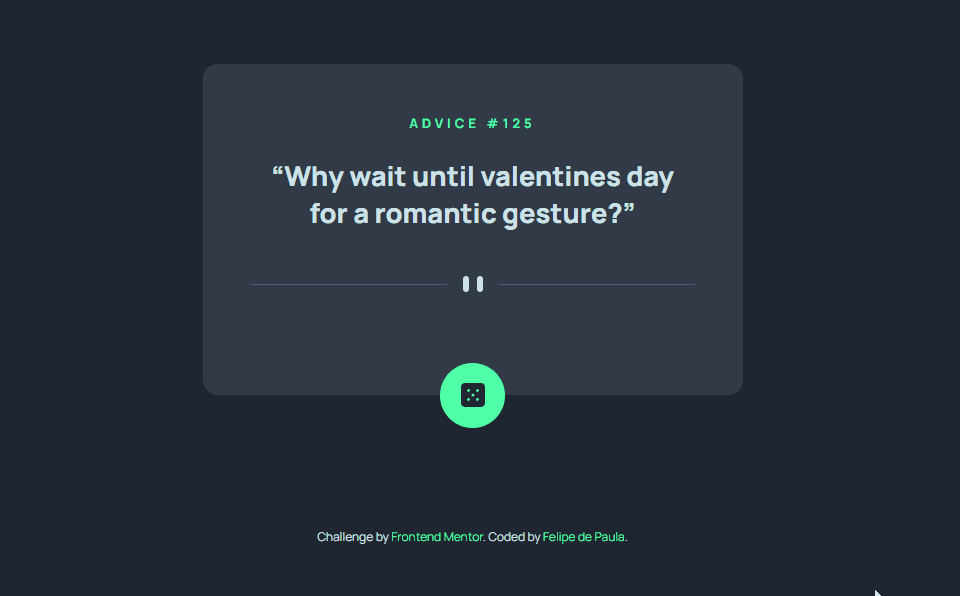

# Frontend Mentor - Advice generator app solution

This is a solution to the [Advice generator app challenge on Frontend Mentor](https://www.frontendmentor.io/challenges/advice-generator-app-QdUG-13db).

## Overview

### The challenge

Users should be able to:

- View the optimal layout for the app depending on their device's screen size
- See hover states for all interactive elements on the page
- Generate a new piece of advice by clicking the dice icon

### Links

[GitHub Pages](https://felipeddp.github.io/advice-generator-with-js-and-api/)

## My process

### Built with

- Semantic HTML5 markup
- CSS custom properties
- Flexbox
- JavaScript
- [Advice Slip API](https://api.adviceslip.com)

### What I learned

This is essentially my first ever project fetching from an API. Even though I was already happy with how the original JavaScript had turned out, I'm glad I revisited it and learned about object destructuring, which made my code cleaner.

I also had a good time revisiting some CSS basics which had gone over my head, like the proper way of applying max-width in tandem with flexbox in order to make my container flexible to only a certain extent.